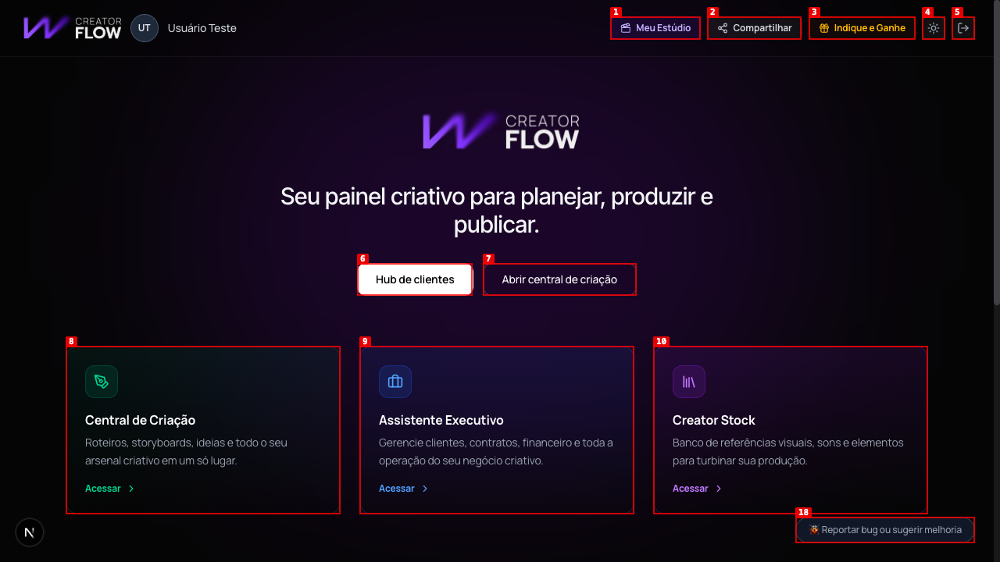
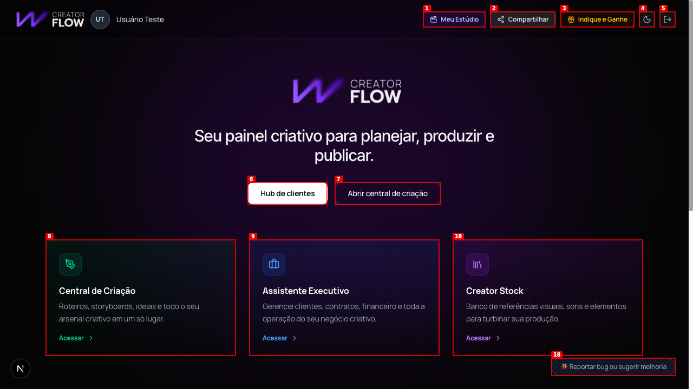
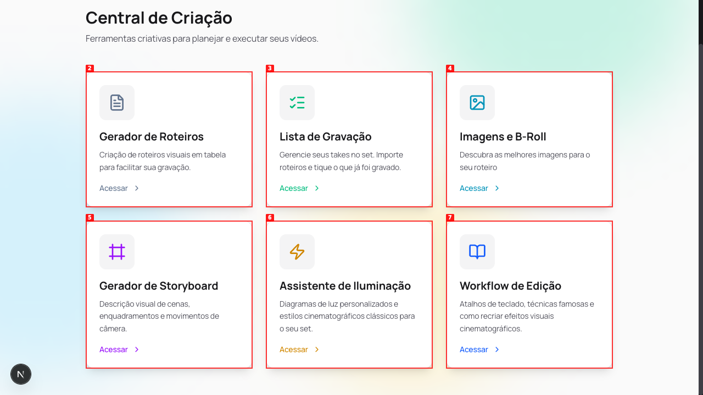
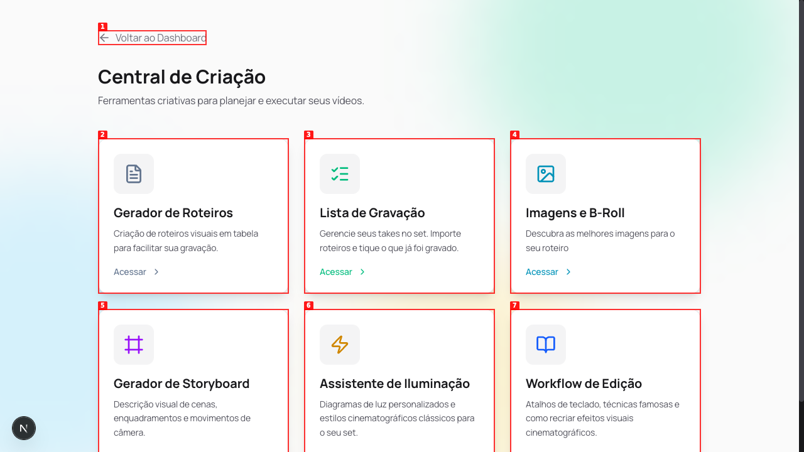
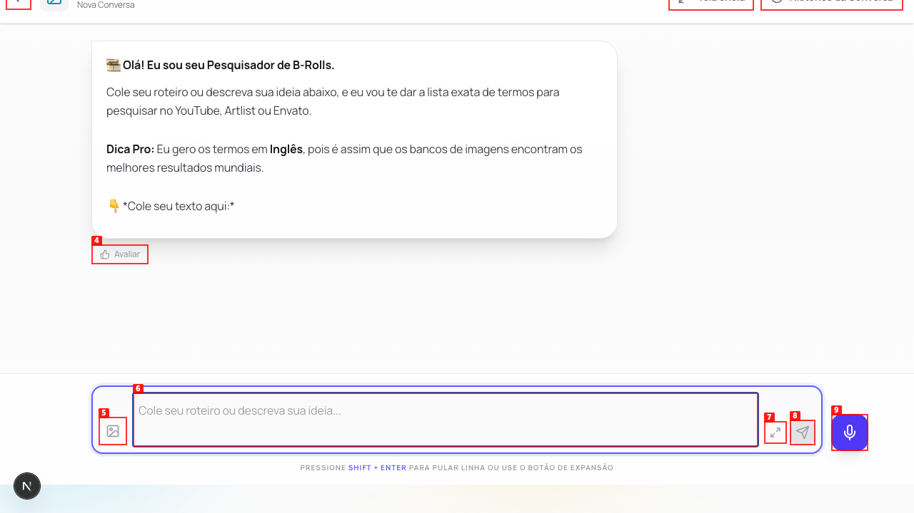
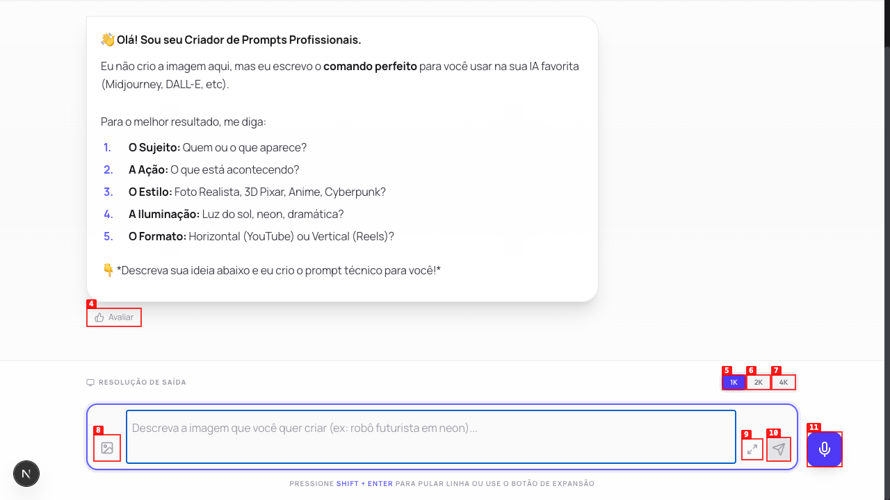
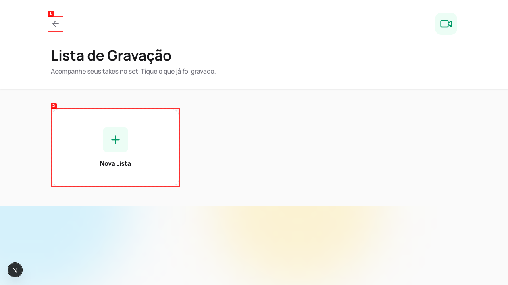
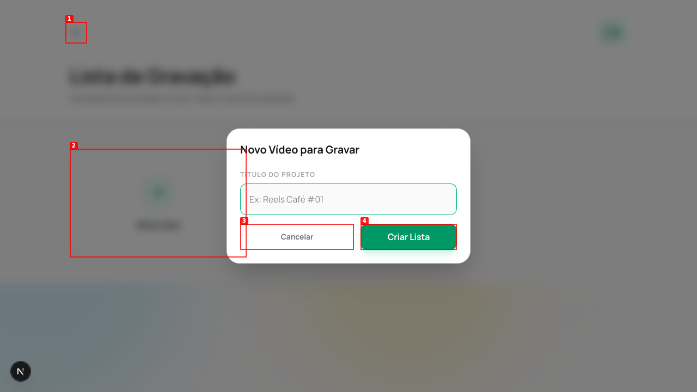
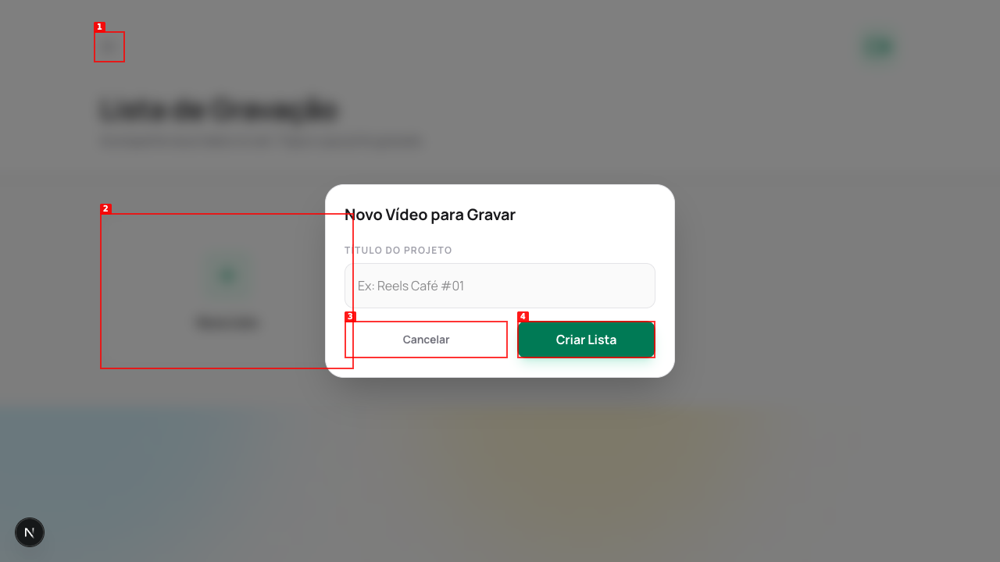

# Dogfood Report: CreatorFlow

| Field | Value |
|-------|-------|
| **Date** | 2026-03-05 |
| **App URL** | http://localhost:3000 |
| **Session** | creatorflow |
| **Scope** | Full app — dashboard, Central de Criação, Assistente Executivo, Creator Stock, Ferramentas Extras, header |

## Summary

| Severity | Count |
|----------|-------|
| Critical | 0 |
| High | 2 |
| Medium | 2 |
| Low | 2 |
| **Total** | **6** |

## Issues

---

### ISSUE-001: Botão "Compartilhar" não faz nada ao ser clicado

| Field | Value |
|-------|-------|
| **Severity** | high |
| **Category** | functional |
| **URL** | http://localhost:3000/dashboard |
| **Repro Video** | videos/compartilhar-test.webm |

**Description**

O botão "Compartilhar" no header do dashboard não produz nenhum efeito visível ao ser clicado — nenhum modal, nenhuma navegação, nenhum toast, nenhuma cópia para clipboard. O botão parece completamente não-funcional. Por contraste, o botão ao lado "Indique e Ganhe" abre corretamente um modal de referral.

**Repro Steps**

1. Acesse o dashboard em http://localhost:3000/dashboard (autenticado)
   

2. Clique no botão "Compartilhar" no header (topo direito)
   

3. **Observe:** Nada acontece. A página permanece sem nenhum feedback ou ação.
   

---

### ISSUE-002: Card "Gerador de Roteiros" não é clicável

| Field | Value |
|-------|-------|
| **Severity** | high |
| **Category** | functional |
| **URL** | http://localhost:3000/dashboard (view Central de Criação) |
| **Repro Video** | videos/gerador-roteiros-test.webm |

**Description**

Na Central de Criação, o card "Gerador de Roteiros" é visualmente apresentado como clicável mas não responde à interação. O link "Acessar" aparece em **cinza** (cor do texto normal) enquanto todos os outros cards têm links coloridos (teal, laranja, roxo, azul). Ao clicar no card, a ação simplesmente não ocorre (timeout de click). Todos os outros 5 cards da Central de Criação funcionam normalmente.

**Repro Steps**

1. No dashboard, clique em "Central de Criação" para abrir o módulo
   

2. Observe os 6 cards: todos têm links "Acessar" coloridos, **exceto** "Gerador de Roteiros" que tem "Acessar" em cinza
   

3. Clique no card "Gerador de Roteiros"

4. **Observe:** Nenhuma navegação ocorre. O card não responde ao clique. O link "Acessar" cinza indica que a ferramenta não está ativa/implementada.
   

---

### ISSUE-003: Asteriscos markdown visíveis em mensagens iniciais de agentes IA

| Field | Value |
|-------|-------|
| **Severity** | medium |
| **Category** | content |
| **URL** | Múltiplas páginas de agentes (Imagens e B-Roll, Gerador de Imagens) |
| **Repro Video** | N/A |

**Description**

As mensagens de boas-vindas de alguns agentes IA exibem asteriscos `*` brutos em volta do texto, em vez de renderizar como negrito. Por exemplo: `*Cole seu texto aqui:*` e `*Descreva sua ideia abaixo e eu crio o prompt técnico para você!*` aparecem com os asteriscos visíveis. Outros agentes como YouTube SEO renderizam o markdown corretamente. O problema é inconsistente entre agentes.

**Repro Steps**

1. No dashboard, acesse **Central de Criação → Imagens e B-Roll**
   

2. **Observe:** A linha `👇 *Cole seu texto aqui:*` exibe os asteriscos literalmente em vez de texto em negrito.

3. O mesmo ocorre em **Ferramentas Extras → Gerador de Imagens**: `*Descreva sua ideia abaixo e eu crio o prompt técnico para você!*`
   

---

### ISSUE-004: Campos obrigatórios em modais da Lista de Gravação sem feedback de validação

| Field | Value |
|-------|-------|
| **Severity** | medium |
| **Category** | ux |
| **URL** | http://localhost:3000/dashboard (view Lista de Gravação) |
| **Repro Video** | N/A |

**Description**

Nos modais "Nova Lista" e "Novo Take" da Lista de Gravação, clicar no botão de confirmação com campos obrigatórios vazios não exibe nenhuma mensagem de validação — o modal simplesmente permanece aberto sem feedback. O usuário não sabe por que a ação falhou. Por contraste, o Assistente Executivo mostra corretamente o tooltip nativo "Preencha este campo." ao tentar submeter com campos vazios. A inconsistência prejudica a experiência.

**Repro Steps**

1. No dashboard, acesse **Central de Criação → Lista de Gravação**
   

2. Clique em "Nova Lista" para abrir o modal
   

3. Deixe o campo "TÍTULO DO PROJETO" vazio e clique em "Criar Lista"
   

4. **Observe:** O modal permanece aberto sem nenhuma mensagem de erro ou destaque no campo obrigatório.

---

### ISSUE-005: Erro 404 recorrente no console em todas as páginas

| Field | Value |
|-------|-------|
| **Severity** | low |
| **Category** | console |
| **URL** | Todas as páginas |
| **Repro Video** | N/A |

**Description**

Em todas as páginas visitadas, o console do browser registra consistentemente: `Failed to load resource: the server responded with a status of 404 (Not Found)`. O erro é client-side (não aparece nos logs do servidor Next.js), indicando que algum recurso estático (imagem, fonte, ícone) está sendo referenciado mas não existe. Embora não impacte visivelmente a UI, pode indicar um asset faltando ou referência quebrada no código.

**Repro Steps**

1. Acesse qualquer página do app autenticado (ex: dashboard)

2. Abra as DevTools do browser → aba Console

3. **Observe:** `Failed to load resource: the server responded with a status of 404 (Not Found)` aparece no carregamento de cada página
   

---

### ISSUE-006: Campos de texto em modais ausentes da accessibility tree

| Field | Value |
|-------|-------|
| **Severity** | low |
| **Category** | accessibility |
| **URL** | Múltiplos modais (Nova Lista, Novo Take, Meu Estúdio) |
| **Repro Video** | N/A |

**Description**

Em vários modais da aplicação, os campos de input de texto principal (`<input type="text">`) não aparecem como `role="textbox"` na accessibility tree (snap shot de acessibilidade). Somente campos `<textarea>` e `<input type="date">` são detectados. Isso impede interação por leitores de tela e dificulta automação de testes. Afeta os modais: "Nova Lista" (campo Título do Projeto), "Novo Take" (campo Cena/Shot), e "Meu Estúdio" (campo Nome da Produtora).

**Repro Steps**

1. Na Lista de Gravação, clique em "Nova Lista"

2. **Observe:** O campo "TÍTULO DO PROJETO" não aparece como `textbox` acessível — apenas os botões Cancelar e Criar Lista são detectados na accessibility tree.
   

---
